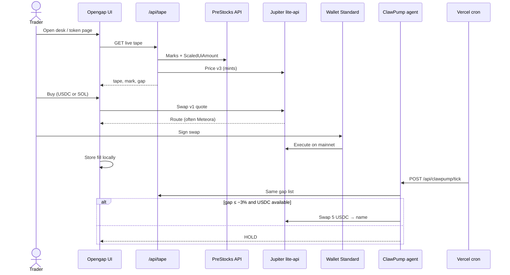
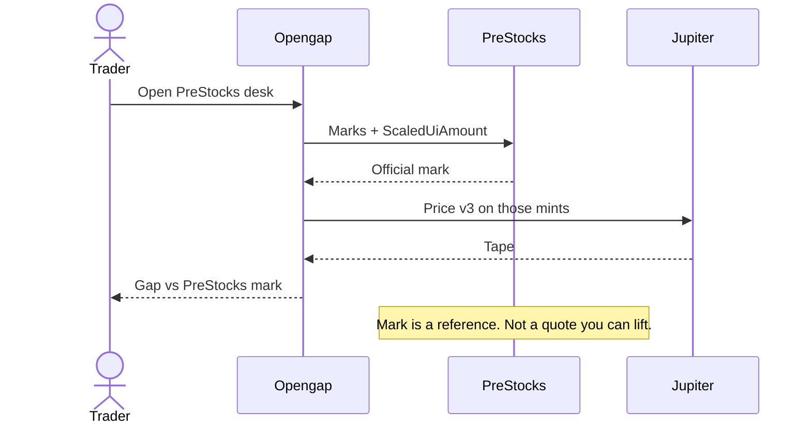
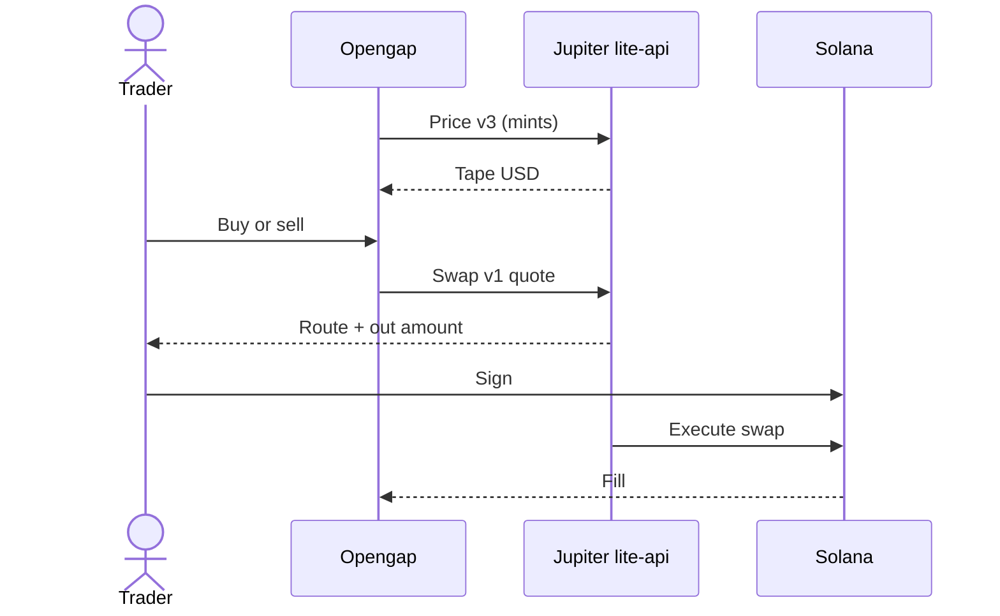
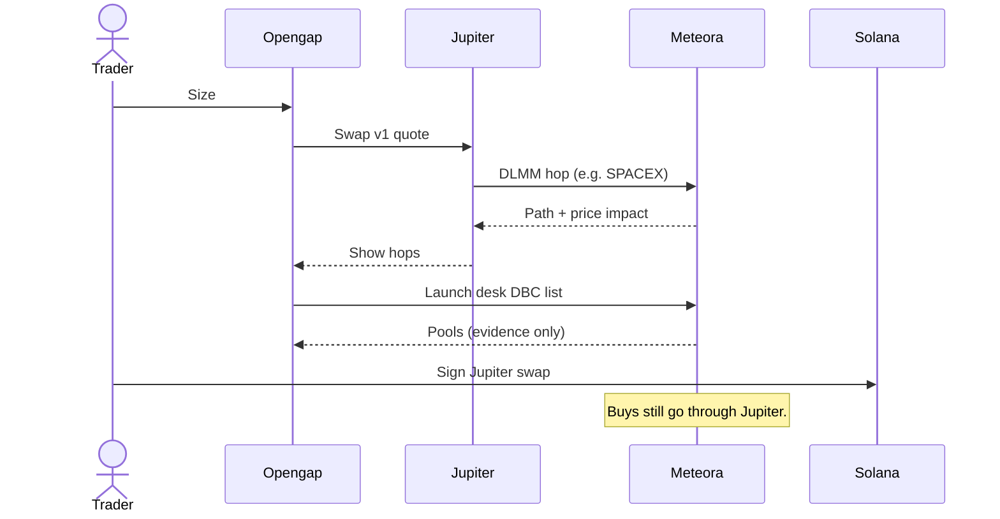
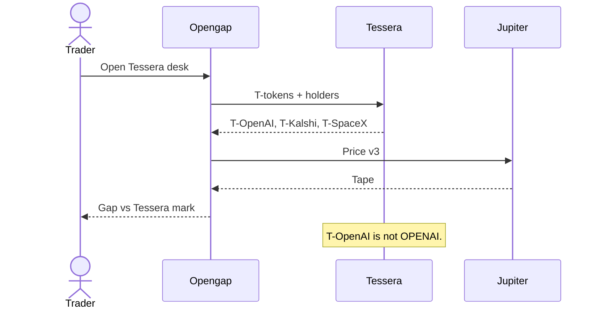
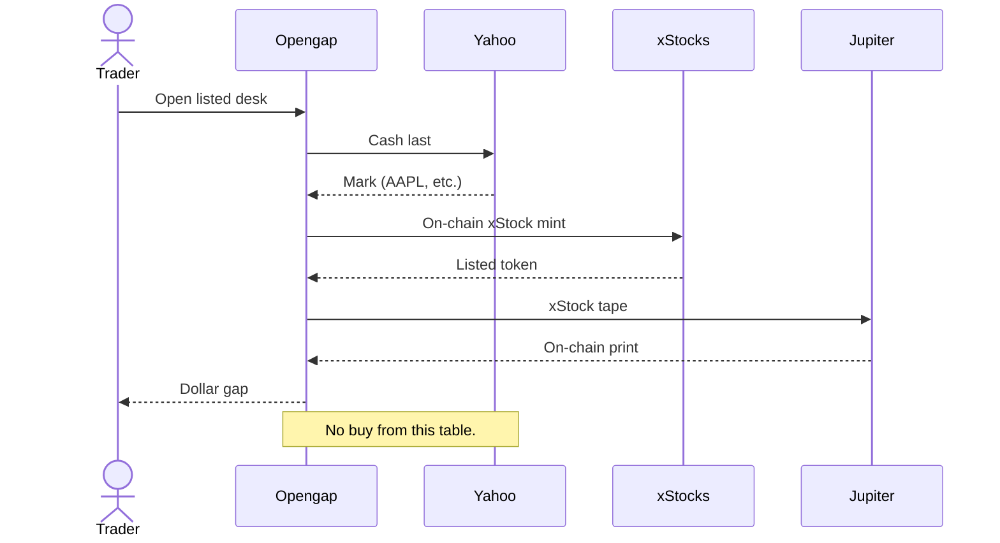
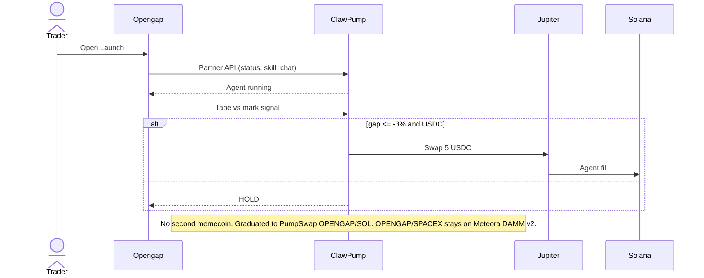
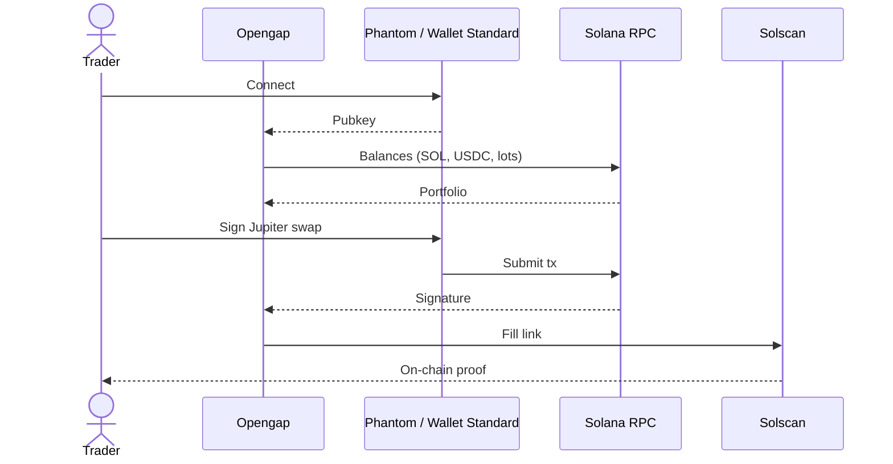

# Opengap


**Buy tokenized stocks when the live price on Jupiter is cheaper than the official reference price from the issuer (PreStocks, or Yahoo on listed names).**

| Link | URL |
| --- | --- |
| App | [https://opengap.xyz](https://opengap.xyz) |
| CA | `Fvto3QgSLbcWdq331BoR66RDkT7dZYgTS9JzbntMf7rD` |
| Token | [https://clawpump.tech/tokens/Fvto3QgSLbcWdq331BoR66RDkT7dZYgTS9JzbntMf7rD](https://clawpump.tech/tokens/Fvto3QgSLbcWdq331BoR66RDkT7dZYgTS9JzbntMf7rD) |
| DexScreener | [https://dexscreener.com/solana/Fvto3QgSLbcWdq331BoR66RDkT7dZYgTS9JzbntMf7rD](https://dexscreener.com/solana/Fvto3QgSLbcWdq331BoR66RDkT7dZYgTS9JzbntMf7rD) — paid by a community member |
| PumpSwap | [https://dexscreener.com/solana/65m5eb4WW7w18HJQ9CbzHR1gqUMor8RrmH1dKP2S8wLn](https://dexscreener.com/solana/65m5eb4WW7w18HJQ9CbzHR1gqUMor8RrmH1dKP2S8wLn) |
| pump.fun | [https://pump.fun/coin/Fvto3QgSLbcWdq331BoR66RDkT7dZYgTS9JzbntMf7rD](https://pump.fun/coin/Fvto3QgSLbcWdq331BoR66RDkT7dZYgTS9JzbntMf7rD) |
| Stock pool | [https://app.meteora.ag/dammv2/Fck8ZewjPmcvY9KZAiQiXx81y7Y8Lr52HLY15kquPqsB](https://app.meteora.ag/dammv2/Fck8ZewjPmcvY9KZAiQiXx81y7Y8Lr52HLY15kquPqsB) |
| Solscan | [https://solscan.io/token/Fvto3QgSLbcWdq331BoR66RDkT7dZYgTS9JzbntMf7rD](https://solscan.io/token/Fvto3QgSLbcWdq331BoR66RDkT7dZYgTS9JzbntMf7rD) |
| X | [https://x.com/Open_Gap](https://x.com/Open_Gap) |
| Telegram | [https://t.me/OpenGapp](https://t.me/OpenGapp) |
| Discord | [https://discord.gg/5qHH5T2EnU](https://discord.gg/5qHH5T2EnU) |
| GitHub | [https://github.com/AmaanSayyad/OpenGap](https://github.com/AmaanSayyad/OpenGap) |
| Pitch | [https://app.chroniclehq.com/share/0f55cc23-897b-4a17-9ae9-c430e7e7eadb/1a938a0a-fb2d-47e7-afda-07774fe4a1f6](https://app.chroniclehq.com/share/0f55cc23-897b-4a17-9ae9-c430e7e7eadb/1a938a0a-fb2d-47e7-afda-07774fe4a1f6) |
| Demo | [https://youtu.be/jr6mO7pstFY](https://youtu.be/jr6mO7pstFY) |
| License | [MIT](LICENSE) |

Opengap is a mainnet Solana desk that compares the **issuer mark** to the **Jupiter tape** — the split-aware price you actually pay — and lets you buy the gap. Green means cheaper than official. The ClawPump desk is a public agent that watches the same tape and can buy a $5 lot when a name is at least 3% cheap. **$OPENGAP** launched on ClawPump and graduated to PumpSwap. The agent does not mint another.

Traction (last 24 hours as of 26 Sep 2026): 20k+ visitors, 1k+ users, $20k+ platform volume, 1k+ community, $600k token volume, 500+ holders. Dev wallet 0.8%. No side wallets.

Not for US persons. Not advice.

---

## What this is and who it's for

Opengap is a trading interface for people who already understand that tokenized private names (PreStocks) and loan tokens (Tessera T-tokens) can print away from the issuer’s reference. It is for:

- Crypto-native traders who want a live **tape vs mark** book, not a blog post
- People who will connect Phantom (or any Wallet Standard wallet) and sign a Jupiter swap
- Judges and operators who need to see PreStocks, Tessera, Jupiter, Meteora, and an on-chain agent in one product

It is not a broker, not a brokerage account, and not a way to buy equity in SpaceX or OpenAI. You buy a Solana token that tracks a claim. If you want the cash equity, this is the wrong site.

---

## Story / inspiration

Private-company “stocks on-chain” arrived on Solana before a readable tape did. PreStocks publishes an official mark. Jupiter publishes what the pool will actually fill. Those two numbers are not the same — Token-2022 `ScaledUiAmount` makes naive unit math worse — and the gap is the whole product.

The inspiration is old-market microstructure: a print versus the official. Bloomberg does this for cash. Opengap does it for tokenized names you can buy in USDC in one signature. The agent exists because watching every name by hand is the job a bot should do, not a landing page.

Two constraints shaped the build:

1. **Stocklana** — live PreStocks + Jupiter (and Tessera / Meteora in the path). Mainnet only. No testnet book.
2. **AnsemHack / ClawPump** — a public running agent with a custom skill. The skill is “buy the discount.” It is forbidden from launching a coin.

---

## Problem

Tokenized stocks on Solana show a price. That price is usually wrong for a trader.

- The **issuer mark** is a reference. It is not a quote you can lift.
- The **Jupiter price** is executable, but raw units ignore PreStocks multipliers, so OPENAI and SPACEX look insane if you treat them like SPL.
- Tessera T-OpenAI is a **loan**, not OPENAI. Same brand, different claim. UIs collapse them.
- Listed xStocks vs Yahoo is evidence, not a buy button — mixing that into a swap UI is how people lose money.
- A “launch” tab that mints a memecoin next to a stock tape is a different product wearing the same jacket.

Nobody ships a desk that says: here is the official number, here is what you pay, green means buy, $5 if the bot agrees.

---

## Solution

One site, four desks, one rule: **green is cheaper than the mark.**

| Desk | Route | Job |
| --- | --- | --- |
| PreStocks | `/` | Private-company tape. Jupiter vs PreStocks mark. Buy / sell in USDC or SOL. |
| Tessera | `/?desk=tessera` | T-tokens. Same buy flow. Different claim. |
| Listed stocks | `/?desk=basis` | Yahoo cash vs xStock tape. Evidence only. |
| ClawPump | `/?desk=clawpump` | OpenGap agent. Watches the tape. Buys at −3%. $OPENGAP graduated to [PumpSwap OPENGAP/SOL](https://dexscreener.com/solana/65m5eb4WW7w18HJQ9CbzHR1gqUMor8RrmH1dKP2S8wLn). Stock-paired Meteora DAMM v2: [OPENGAP/SPACEX](https://app.meteora.ag/dammv2/Fck8ZewjPmcvY9KZAiQiXx81y7Y8Lr52HLY15kquPqsB). |

Open a name with `/?buy=SPACEX`. Replay the guide with `/?tour=1`. Search from the header. Portfolio is local fills plus live wallet lots.

---

## Key features

- Split-aware Jupiter **tape** next to issuer **mark**, with gap in percent
- Buy / sell sheet that quotes Jupiter Swap v1, takes a disclosed **1% platform fee**, and shows Meteora hops
- Token pages, portfolio, local fill history with Solscan links
- Buy every name (equal USDC split) and a running ticker
- Tessera vs PreStocks claim split so T-OpenAI is not OPENAI
- Listed desk: Yahoo vs xStock, no buy
- ClawPump agent with a custom “OpenGap Basis Trader” skill
- Cost-only launch quote — nothing is created
- Product tour after connect, including a real token page and `/portfolio`

---

## How it works

1. Server pulls PreStocks (or Tessera) marks.
2. Server asks Jupiter Price v3 for those mints and applies Token-2022 scaled UI amounts.
3. Gap = `(tape − mark) / mark`. Green if tape is cheaper than mark. That gap is the trade.
4. You pick a size. The app asks Jupiter Swap v1 with a **1% platform fee**. You sign. The route often hops Meteora DLMM. The quote you see is already after the cut.
5. The fill is stored in this browser and valued against the live mark.
6. Every 15 minutes a Vercel cron can hand the same gap list to the OpenGap agent. If a name is ≤ −3% and the wallet has USDC, it may buy $5. Otherwise it holds.



---

## How the sponsors are integrated

| Sponsor | Where it lives | What we actually call |
| --- | --- | --- |
| **PreStocks** | Tape, token page, basket | Official marks and Token-2022 multipliers. Naive Jupiter raw units are not used as the mark. |
| **Jupiter** | Quote, swap, tape USD | `lite-api.jup.ag` Price v3 + Swap v1. The quote on screen is the quote you sign. |
| **Meteora** | Route hops, Launch pools | DLMM/DBC hops on names like SPACEX. DBC listed as venue evidence. Buys still go through Jupiter. |
| **Tessera** | Tessera desk, claim split | T-OpenAI, T-Kalshi, T-SpaceX + holder counts from their public API. |
| **xStocks / Yahoo** | Listed desk | Cash vs on-chain evidence. No buy from that table. |
| **ClawPump** | Launch desk, cron, skill | Partner API v1 + platform custom skill. Agent id is public. Dashboard key stays server-side. No `POST /launch` mint. |
| **Solana** | Wallet, RPC, Solscan | Mainnet. Wallet Standard (Phantom). Optional `NEXT_PUBLIC_SOLANA_RPC`. |

### PreStocks

Official mark. Token-2022 `ScaledUiAmount`. Not the tape.



### Jupiter

Tape you pay. Quote you sign. Price v3 + Swap v1.



### Meteora

Hops on the Jupiter route. DBC is venue evidence. Not a second buy button.

Primary $OPENGAP pool is [OPENGAP/SOL on PumpSwap](https://dexscreener.com/solana/65m5eb4WW7w18HJQ9CbzHR1gqUMor8RrmH1dKP2S8wLn). Stock-paired pool: [OPENGAP/SPACEX DAMM v2](https://app.meteora.ag/dammv2/Fck8ZewjPmcvY9KZAiQiXx81y7Y8Lr52HLY15kquPqsB).



### Tessera

T-tokens. Same buy flow. Loan claim, not PreStock equity.



### xStocks / Yahoo

Listed desk. Cash vs on-chain. Evidence only.



### ClawPump

Launch desk. Custom skill. Buy the discount. $OPENGAP graduated to PumpSwap — never mint again.



### Solana

Mainnet. Wallet Standard. RPC. Solscan.



Secrets never go in `NEXT_PUBLIC_*` or git.

---

## Tech stack

- **Next.js 16** App Router, React 19, TypeScript
- **Tailwind v4** + shadcn/ui
- **@solana/web3.js** + Wallet Adapter / Wallet Standard
- **Jupiter** lite-api (Price v3, Swap v1)
- **Meteora** Dynamic Bonding Curve SDK (venue checks, not a separate buy path)
- **ClawPump** Partner API + custom skill (`skills/opengap-basis`)
- **Vercel** — [opengap.xyz](https://opengap.xyz), Fluid Compute, cron `*/15` → `/api/clawpump/tick`

---

## Architecture

```
src/
  app/api/          tape, tessera, quote, swap, basis, clawpump, launch, wallet
  components/       desks, buy sheet, portfolio, tour, launch agent room
  lib/              prestocks, jupiter, tessera, meteora, clawpump, swap
  hooks/            tape feed, balances, fills, watchlist
skills/opengap-basis/   agent instructions (never mint)
```

- **Server** owns marks, Jupiter prices, ClawPump, and any private key.
- **Client** owns wallet signatures, localStorage fills, and UI state.
- **Agent** is a hosted ClawPump runtime. Opengap only sends signals and start/stop/chat.

---

## Competitors

| Product | Overlap | Why Opengap is different |
| --- | --- | --- |
| PreStocks.com | Issuer UI | They publish the mark. We publish mark vs executable tape. |
| Jupiter / jup.ag | Swap | They are the venue. We are the stock tape that uses them. |
| Generic Solana DEX screens | Price | They show a pool. They do not decode ScaledUiAmount vs issuer. |
| xStocks dashboards | Listed names | We treat listed as evidence, not a fake buy. |
| ClawPump “launch a coin” agents | Agent host | Our agent is forbidden from minting. It trades the gap. |
| Robinhood / cash brokers | Stocks | Different asset. We do not sell equity. |

---

## Business model

The desk charges **1% on every Jupiter buy and sell**. The quote is already net of the fee. The swap sends it in USDC or SOL to the OpenGap fee wallet `5zhihBK87rutEfE6aSw93GNF6EMZk8L6nppmxorLNzYZ`. It is on the ticket, the basket, and the footer — not a hidden tax.

Other lines:

1. **$OPENGAP** — launched on ClawPump, now graduated to PumpSwap. Creator fees stay with the project. Membership / fee-share, not equity, not a second take on the swap. The agent will not mint another.
2. **Agent inventory** — people can fund the OpenGap trading wallet so the bot keeps buying −3% lots. That is inventory, not another cut.
3. **Alerts / pro tape** — gap webhooks, CSV, basket limits. Paid only if someone asks.

No claim that this is a licensed venue.

---

## Team

**Amaan Sayyad (CEO)** — blockchain developer and entrepreneur. 42+ hackathon wins, 25+ shipped Web3 products, CEO of OpenGap. [X](https://x.com/amaanbiz) · [GitHub](https://github.com/AmaanSayyad) · [LinkedIn](https://www.linkedin.com/in/amaan-sayyad-/) · [Portfolio](https://amaan-sayyad-portfolio.vercel.app/) · [Proof](https://docs.google.com/document/d/1WQXjpoRdcEHiq3BiVaAT3jXeBmI9eFvKelK9EWdWOQA/edit?usp=sharing)

Contract helpers: Abdulmajid Hassan (community), Konan (design), VR (graphics), Draheem (motion).

## Market

Tokenized private and listed names trade 24/7 on Solana. Jupiter often prints away from the issuer mark. That gap is the market. OpenGap is the desk — and the bot — that buys only when live is cheaper than official.

## Token

**$OPENGAP** mint `Fvto3QgSLbcWdq331BoR66RDkT7dZYgTS9JzbntMf7rD` · launched 24 Sep 2026 on [ClawPump](https://clawpump.tech/tokens/Fvto3QgSLbcWdq331BoR66RDkT7dZYgTS9JzbntMf7rD) against [@Open_Gap](https://x.com/Open_Gap). Graduated to [OPENGAP/SOL on PumpSwap](https://dexscreener.com/solana/65m5eb4WW7w18HJQ9CbzHR1gqUMor8RrmH1dKP2S8wLn). [DexScreener](https://dexscreener.com/solana/Fvto3QgSLbcWdq331BoR66RDkT7dZYgTS9JzbntMf7rD) paid by a community member. Stock-paired pool: [OPENGAP/SPACEX on Meteora DAMM v2](https://app.meteora.ag/dammv2/Fck8ZewjPmcvY9KZAiQiXx81y7Y8Lr52HLY15kquPqsB). Room: [Discord](https://discord.gg/5qHH5T2EnU). Pitch: [Chronicle deck](https://app.chroniclehq.com/share/0f55cc23-897b-4a17-9ae9-c430e7e7eadb/1a938a0a-fb2d-47e7-afda-07774fe4a1f6). Demo: [YouTube](https://youtu.be/jr6mO7pstFY).

Utility: AnsemHack entry ticket and $OPENGAP creator-fee share. Desk revenue is the 1% Jupiter platform fee. Not equity. Not the product. The agent will not mint a second coin.

Supply: **0.8% in the dev wallet. No side wallets.** Two early sales at about **$20k market cap**.

Long-term: the desk stays the company. Volume on the tape is the fee line. The token is membership / creator-fee share, not a second swap tax. Roadmap is funded −3% buys, more names, and a kill-switch — not a new memecoin.

## Go-to-market

1. Stocklana path (tape + Jupiter + Tessera + Meteora) and AnsemHack path (public agent + live token).
2. **ClawPump marketplace** — agent is public; ClawPump desk is the product page; [$OPENGAP on DexScreener](https://dexscreener.com/solana/Fvto3QgSLbcWdq331BoR66RDkT7dZYgTS9JzbntMf7rD) is the entry.
3. **Crypto Twitter** — [@Open_Gap](https://x.com/Open_Gap), [Telegram](https://t.me/OpenGapp), [Discord](https://discord.gg/5qHH5T2EnU), the [pitch deck](https://app.chroniclehq.com/share/0f55cc23-897b-4a17-9ae9-c430e7e7eadb/1a938a0a-fb2d-47e7-afda-07774fe4a1f6), and the [demo video](https://youtu.be/jr6mO7pstFY). One sentence: buy tokenized stocks when they're cheaper. Link the deepest green name. A community member paid for [DexScreener](https://dexscreener.com/solana/Fvto3QgSLbcWdq331BoR66RDkT7dZYgTS9JzbntMf7rD).
4. **Wallet users** — Phantom in, one $25 Jupiter lot, 1% platform fee, fill stays in History.
5. **Do not** pretend this is a US stock app. Legal line stays in the footer.

Traction (last 24 hours as of 26 Sep 2026): **20k+ visitors**, **1k+ users**, **$20k+ platform volume**, **1k+ community**, **$600k token volume**, **500+ holders**.

---

## Roadmap

- 1% platform fee is live on Jupiter buys and sells
- Fund the agent wallet with USDC so HOLD is not the only decision
- $OPENGAP graduated to PumpSwap; do not mint a second token
- Tighter inventory and kill-switch on the skill
- More PreStocks names as they list
- Server-side fill archive (optional, opt-in) — today history is local
- Better RPC and quote retries when Jupiter 429s

---

## Run

```bash
npm install
cp .env.example .env.local
npm run dev
```

Local: [http://localhost:3000](http://localhost:3000). Live links are in the table at the top.

| Variable | Where | Notes |
| --- | --- | --- |
| `NEXT_PUBLIC_SOLANA_RPC` | Client + server | Defaults to publicnode. Not a secret. |
| `CLAWPUMP_API_KEY` | Server | Dashboard key. Never `NEXT_PUBLIC_`. |
| `CLAWPUMP_AGENT_ID` | Server | Defaults to the OpenGap agent. |
| `CRON_SECRET` | Server | Protects `/api/clawpump/tick`. |
| `SOLANA_PRIVATE_KEY` | Server | Optional test wallet only. |
| `PLATFORM_FEE_WALLET` | Server | Receives the 1% Jupiter fee. Defaults to `5zhihBK87rutEfE6aSw93GNF6EMZk8L6nppmxorLNzYZ`. |

Never commit `.env.local`.

---

## How to read a row

**Tape** is the live price on Jupiter — what you actually pay if you buy right now.

**Mark** is the official reference price from the issuer (PreStocks, or Yahoo on listed names). It is not a quote you can lift.

**Book** is the old name for your portfolio: SOL, USDC, and any lots you hold, with live dollar values. The app now says Portfolio everywhere.

**Green** means tape is cheaper than mark. That gap is the trade.

On the table, **To mark** is `(tape − mark) / mark`. Green is a discount. Red is a premium. After a buy, fill vs mark stays in this browser and links out on Solscan.

---

## License

MIT. See [LICENSE](LICENSE).
